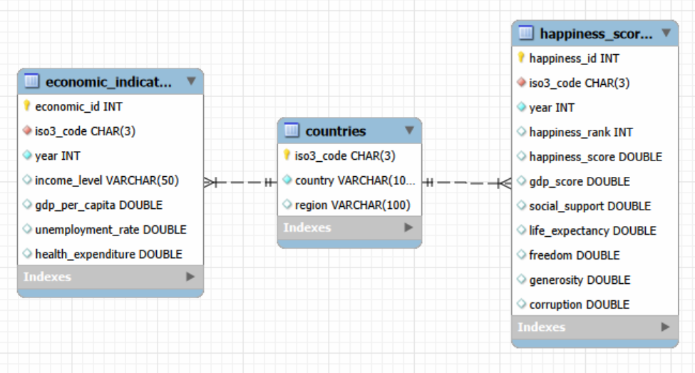

### Felicidad y economía mundial: análisis de factores económicos y sociales

### Objetivo del proyecto:

Analizar la relación entre el nivel de felicidad de los países y distintos factores económicos y sociales durante el periodo 2015–2019. El objetivo principal es estudiar si mayores niveles de riqueza están asociados con mayores niveles de felicidad y analizar cómo otros indicadores, como el desempleo y el gasto sanitario, pueden relacionarse con el bienestar de los países.

### Contexto del negocio:

Este proyecto plantea un escenario de análisis socioeconómico internacional en el que se busca comprender qué factores están relacionados con mayores niveles de bienestar entre países.

El análisis puede servir como apoyo para identificar patrones entre felicidad,riqueza, empleo y gasto sanitario, así como diferencias entre regiones y niveles de ingresos.

### Dataset: El proyecto combina dos fuentes de datos diferentes:

1. World Happiness Report

Datos correspondientes al periodo 2015–2019.

Principales variables:

- `country`: país
- `year`: año
- `happiness_rank`: posición del país en el ranking de felicidad
- `happiness_score`: puntuación de felicidad
- `gdp_score`: componente económico incluido en el World Happiness Report
- `social_support`: apoyo social
- `life_expectancy`: esperanza de vida saludable
- `freedom`: libertad para tomar decisiones
- `generosity`: generosidad
- `corruption`: percepción de corrupción

2. World Bank API

Los datos económicos se obtienen mediante la API del Banco Mundial.

Principales variables:

- `iso3_code`: código internacional del país
- `region`: región
- `income_level`: nivel de ingresos
- `gdp_per_capita`: PIB per cápita
- `unemployment_rate`: tasa de desempleo
- `health_expenditure`: gasto sanitario como porcentaje del PIB

### Estructura de la base de datos: La base de datos se organiza en tres tablas relacionadas:

- `countries`
- `happiness_scores`
- `economic_indicators`

Las tablas se relacionan mediante `iso3_code`, utilizado como identificador común de los países.

### Calidad de los datos:

Los archivos del World Happiness Report presentan diferencias en los nombres de las columnas entre los distintos años, por lo que fue necesario homogeneizar su estructura antes de combinarlos.

También se normalizaron los nombres de los países utilizando los códigos ISO3 del Banco Mundial para poder integrar ambas fuentes.

Los valores ausentes en los indicadores económicos se mantienen como valores nulos, ya que la ausencia de información no implica que el indicador tenga valor cero.

### Preguntas clave:

1. ¿Qué relación existe entre el PIB per cápita y el nivel de felicidad de los países?

2. ¿Aumenta siempre la felicidad a medida que aumenta la riqueza o parece estabilizarse a partir de determinados niveles de PIB per cápita?

3. ¿Cómo ha evolucionado la felicidad de los países y regiones entre 2015 y 2019?

4. ¿Qué relación existe entre la felicidad y otros indicadores económicos como el desempleo y el gasto sanitario?

5. ¿Existen países con niveles similares de PIB per cápita pero niveles de felicidad muy diferentes?

### Proceso de análisis:

1. Adquisición de datos

- Descarga de los archivos CSV del World Happiness Report.
- Obtención de indicadores económicos mediante la API del Banco Mundial.
- Almacenamiento local de los datos obtenidos mediante API.

2. Limpieza y transformación

- Exploración inicial de los datasets.
- Homogeneización de columnas entre los diferentes años.
- Tratamiento de valores nulos.
- Normalización de países mediante códigos ISO3.
- Eliminación de agregados regionales del Banco Mundial.
- Integración de las diferentes fuentes mediante país y año.

3. Diseño de la base de datos

Se diseñó un modelo relacional compuesto por tres tablas:

- `countries`: información general de cada país y su región.
- `happiness_rating`: indicadores relacionados con la felicidad para cada país y año.
- `economic_indicators`: indicadores económicos obtenidos del Banco Mundial.

Las tablas se relacionan mediante el código ISO3 de cada país y, en el caso de los datos temporales, mediante el año.

4. Modelo de la base de datos

5. Análisis SQL

Una vez creada la base de datos, se realizaron diferentes consultas SQL para responder a las preguntas planteadas en el proyecto.

Durante el análisis se utilizaron técnicas como:

- `JOIN` para combinar información de las diferentes tablas.
- `GROUP BY` y funciones de agregación (`AVG`, `COUNT`, `MIN`, `MAX`).
- `CASE` para crear grupos de PIB per cápita.
- Subqueries para comparar indicadores con sus valores medios.
- Cálculo del coeficiente de correlación de Pearson para estudiar la relación entre diferentes variables.
- Self joins para comparar países entre sí.

### Resultados / Insights:

## 1. PIB per cápita y felicidad

Se obtuvo una correlación de Pearson de **0.723** entre el PIB per cápita y la puntuación de felicidad.

Esto muestra una asociación positiva: en general, los países con mayor PIB per cápita tienden a presentar mayores niveles de felicidad.

Sin embargo, esta relación no implica causalidad y el PIB por sí solo no explica todas las diferencias de felicidad entre países.

## 2. ¿Más riqueza significa siempre más felicidad?

Al agrupar los países según su nivel de PIB per cápita, se observa que la felicidad aumenta claramente en los niveles más bajos de riqueza.

Sin embargo, a medida que aumenta el PIB per cápita, los incrementos de felicidad son menores y dejan de seguir un crecimiento constante.

Los resultados sugieren que la relación entre riqueza y felicidad pierde fuerza en los niveles más altos de PIB, aunque no se puede establecer un punto exacto a partir del cual la felicidad se estabilice.

## 3. Evolución de la felicidad entre 2015 y 2019

La felicidad media global se mantuvo prácticamente estable durante el periodo analizado, pasando de **5.37 en 2015 a 5.40 en 2019**.

Sin embargo, esta estabilidad global oculta diferencias importantes entre regiones y países.

- Europe & Central Asia aumentó aproximadamente **+0.19 puntos**.
- Sub-Saharan Africa aumentó aproximadamente **+0.12 puntos**.
- Benin presentó uno de los mayores aumentos observados, con aproximadamente **+1.54 puntos**.
- Venezuela presentó uno de los mayores descensos, con aproximadamente **-2.10 puntos**.

Por tanto, la evolución de la felicidad fue muy diferente dependiendo de la región y del país analizado.

## 4. Desempleo, gasto sanitario y felicidad

La correlación entre desempleo y felicidad fue de **-0.202**, lo que indica una asociación negativa débil.

Esto significa que mayores tasas de desempleo tienden a estar asociadas con niveles ligeramente inferiores de felicidad, aunque la relación observada es débil.

Por otro lado, la correlación entre gasto sanitario y felicidad fue de **0.375**, mostrando una asociación positiva.

En comparación, ambas relaciones son considerablemente más débiles que la observada entre PIB per cápita y felicidad (**0.723**).

## 5. Países con riqueza similar y diferente felicidad

El análisis también permitió identificar países con niveles similares de PIB per cápita pero diferencias importantes en sus niveles de felicidad.

Para realizar esta comparación se consideró:

- PIB similar: diferencia máxima del **10%**.
- Felicidad muy diferente: diferencia mínima de **1 punto**.

Se encontraron diferentes pares de países que cumplen ambas condiciones.

Por tanto, un nivel de riqueza similar no implica necesariamente un nivel de felicidad similar. Esto refuerza la idea de que existen otros factores, además del PIB per cápita, asociados con las diferencias de felicidad entre países.

# Conclusiones

El análisis muestra que existe una relación clara entre el desarrollo económico y la felicidad, especialmente en el caso del PIB per cápita.

Sin embargo, la riqueza no explica por sí sola el bienestar de un país. La relación entre PIB y felicidad pierde fuerza en niveles elevados de riqueza y existen países con niveles económicos similares que presentan diferencias importantes en sus puntuaciones de felicidad.

Además, otros indicadores económicos analizados presentan relaciones más débiles: el desempleo muestra una asociación negativa débil con la felicidad, mientras que el gasto sanitario presenta una asociación positiva.

En conjunto, los resultados sugieren que la felicidad es un fenómeno multidimensional y que debe analizarse teniendo en cuenta tanto factores económicos como sociales.

### Recomendaciones de negocio

Los resultados sugieren que el PIB per cápita no debería utilizarse de forma aislada como indicador del bienestar de una población.

Para evaluar el desarrollo de un país sería recomendable complementar los indicadores económicos tradicionales con medidas relacionadas con el bienestar, la salud y otros factores sociales.

Además, las diferencias encontradas entre países con niveles similares de riqueza muestran la importancia de estudiar qué otros factores pueden estar asociados con mayores niveles de felicidad.

### Limitaciones

- Algunos indicadores presentan valores ausentes para determinados países y años.
- El periodo analizado está limitado a **2015–2019**.
- La disponibilidad de información varía entre países.
- Las correlaciones observadas representan asociaciones entre variables y no permiten establecer relaciones de causalidad.
- La comparación entre países puede estar influida por factores sociales, culturales o institucionales que no están incluidos en este análisis.

### Próximos pasos

Con más tiempo y datos disponibles, el proyecto podría ampliarse mediante:

- Incorporación de años más recientes del World Happiness Report.
- Inclusión de nuevos indicadores económicos y sociales.
- Análisis de variables como educación, desigualdad, esperanza de vida o protección social.
- Estudio más detallado de los países que presentan niveles similares de PIB pero grandes diferencias de felicidad.
- Creación de visualizaciones interactivas o un dashboard que permita explorar los resultados por país, región y año.

### Cómo replicar el proyecto 